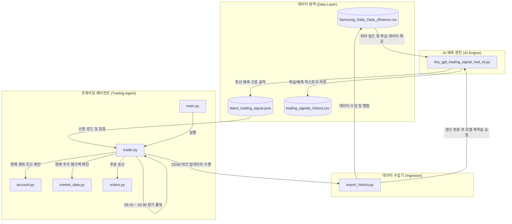

# Samsung Auto Trader — 시스템 설명서 및 운영 가이드

본 문서는 한국투자증권 OpenAPI와 PyTorch 기반의 **Tiny GPT** 예측 모델을 결합한 삼성전자(005930) 주식 자동매매 시스템 `samsung_auto_trader` 프로젝트의 동작 원리, 상세 구성 파일 역할 및 핵심 트레이딩 로직에 대해 기술합니다.

---

## 1. 시스템 아키텍처 및 흐름도

시스템은 크게 **데이터 수집(Ingestion) 및 적재**, **AI 모델 학습 및 신호 예측(AI Engine)**, 그리고 **실시간 자동 주문 실행(Trading Agent)**의 세 단계로 나뉩니다.



### 1) 일중 트레이딩 루프 (09:10 ~ 15:30 KST)
- `AutoTrader`는 설정된 폴링 주기(`polling_interval_seconds=120`, 즉 2분)마다 `_trade_cycle()`을 반복 실행합니다.
- `market_data.py`의 실시간 현재가와 `account.py`의 잔고 정보를 조회합니다.
- 최신 AI 신호 파일(`latest_trading_signal.json`)을 로드하고 **위험 및 신뢰도 다중 가드**를 검사한 후, 조건 만족 시 매수/매도 주문을 KIS API로 전송합니다.

### 2) 야간 데이터 갱신 및 재학습 루틴 (23:00 KST)
- 장이 완전히 종료되고 거래 정보가 정리된 23:00(서울 시간) 이후, 자동으로 하루 치 종가(EOD) 데이터를 추가 갱신합니다.
- `export_historical_prices` 함수를 호출하여 당일 영업일 데이터를 수집 및 병합하고, PyTorch의 `TinyGPTTradingSignal` 모델을 재학습하여 다음 거래일을 위한 예측 신호 JSON을 생성합니다.

---

## 2. 파일별 역할 정의

| 파일명 | 유형 | 역할 요약 |
| :--- | :---: | :--- |
| `main.py` | Python 소스 | 애플리케이션 진입점. 로깅 및 설정을 로드하고 `AutoTrader` 인스턴스를 초기화하여 실행합니다. |
| `trader.py` | Python 소스 | 핵심 오토 트레이더 루프(`AutoTrader` 클래스). 매매 루프 제어, 신호 검증 및 야간 갱신 예약을 관리합니다. |
| `config.py` | Python 소스 | 환경 변수 및 설정 데이터 클래스(`Settings`). 계좌 정보, API 도메인(기본값: KIS 모의투자 서버), 매매 시간 및 각종 기본 상수를 설정합니다. |
| `auth.py` | Python 소스 | OAuth 토큰 관리 클래스(`TokenManager`). 토큰 캐시 및 만료 시간 확인, 자동 갱신 요청을 처리합니다. |
| `api_client.py` | Python 소스 | KIS REST API 호출을 단순화하는 `ApiClient` 클래스. 헤더 구성, 요청 재시도 및 401 인증 만료 처리 기능을 갖춥니다. |
| `market_data.py` | Python 소스 | 실시간 시세 및 과거 시세 정보를 조회하고 CSV로 저장하는 헬퍼 함수 제공. |
| `account.py` | Python 소스 | 예수금/잔액 정보(`get_account_summary`) 및 특정 종목 보유 수량/평가 데이터(`get_account_holdings`)를 반환합니다. |
| `orders.py` | Python 소스 | 매수/매도 주문 전송 인터페이스(`place_order`). 결과와 주문 번호를 구조화된 `OrderResult` 객체로 반환합니다. |
| `export_history.py` | Python 소스 | KIS API로 삼성전자 일별 데이터를 조회한 뒤 로컬 CSV와 통합하여 날짜 순으로 고유 누적합니다. |
| `tiny_gpt_trading_signal_real_cli.py` | Python 소스 | GPT 기반 AI 신호 예측 엔진. 데이터의 기술적 지표 변환, 토큰화, Tiny GPT 모델 학습/추론 및 파일 기록(`generate_signal`)을 진행합니다. |
| `test_trading_logic.py` | Python 소스 | 거래 조건부 의사결정 함수들의 정상 동작 여부를 로컬 단위 테스트/시나리오 테스트로 검증합니다. |
| `logger.py` | Python 소스 | 콘솔 및 파일 로깅의 기본 출력 포맷과 레벨을 제어합니다. |
| `Samsung_Daily_Data_yfinance.csv` | 데이터 파일 | 시스템의 로컬 일봉 가격 DB. 시가, 고가, 저가, 종가 및 누적 거래량이 저장됩니다. |
| `latest_trading_signal.json` | 데이터 파일 | 학습이 완료된 AI 모델이 예측한 최신 거래 신호 및 학습 요약 정보가 담긴 JSON. |
| `trading_signals_history.csv` | 데이터 파일 | 과거 예측 및 라벨 데이터와 기술적 지표를 병합하여 모니터링할 수 있도록 저장된 CSV 로그. |
| `token_cache.json` | 캐시 파일 | KIS OpenAPI 인증용 JWT 엑세스 토큰이 캐시되는 곳으로 만료 체크 시 자동 갱신됩니다. |
| `Samsung_daily_data.ipynb` | Jupyter | 시세 정보 데이터 확인 및 프로토타입 분석용 노트북입니다. |

---

## 3. 핵심 트레이딩 결정 규칙 (Trading Logic & Risk Guard)

`AutoTrader`는 매 루프마다 신호를 가져와 다음의 단계를 거쳐 매매 여부를 엄격히 심사합니다.

### 1단계: 신호 정밀 검증 (`_validate_signal`)
1. **종목 코드 검증**: 설정한 대상 종목(`005930`)과 일치하는가?
2. **날짜 검증**: 신호의 생성 기준 시간(`as_of_date`)이 유효하고 미래의 데이터가 아닌가?
3. **가드 체크**: 예측 신호에 `action_blocked_by_confidence`가 걸려있진 않은가?
4. **신뢰도 가드 (Confidence Guard)**: 예측의 확신도(`confidence`)가 **0.45 이상**인가?
5. **엔트로피 가드 (Normalized Entropy Guard)**: 모델 출력의 정규화 엔트로피(`normalized_entropy`)가 **0.95 이하**인가? (엔트로피가 0.95를 초과하면 모델의 결과 불확실성이 크다고 보아 강제 HOLD 전환)
6. **성능 가드 (Balanced Accuracy Guard)**: 학습 검증 데이터 성능 평가 지표인 `best_validation_balanced_accuracy`가 **0.36 이상**인가? (모델 성능 자체가 좋지 못한 상태면 매매 차단)

> [!WARNING]
> 위의 조건 중 **단 하나라도 불만족 시** 매수 또는 매도 신호는 강제로 **`HOLD`** 처리되며 거래를 보류합니다.

### 2단계: 주문 결정 및 자금 계산

#### **매수 (BUY) 규칙**
- 현금 한도 내에서 1주 이상 구매 가능한 수량을 정수로 산정합니다.
- 1회 주문할 수 있는 최대 사용 금액 한도는 다음 중 최솟값을 채택합니다:
  $$\text{MaxOrderCash} = \min(\text{AvailableCash} \times 0.10, \, \max(0.0, \, \text{TotalEquity} \times 0.30 - \text{HoldingQty} \times \text{CurrentPrice}))$$
  - **예수금 비율 한도**: 보유 중인 사용 가능한 현금(`available_cash`)의 **최대 10%**만 매수에 투입합니다.
  - **비중 유지 한도**: 전체 평가 자산(`total_equity`) 중 해당 종목 비중이 **최대 30%**를 넘지 않도록 제한합니다.
- 계산된 `max_order_cash`가 현재가보다 낮아 1주조차 구매할 수 없을 때는 매수를 진행하지 않습니다.
- **주문 단가**: 실시간 현재 시장 가격(`current_price`) 그대로 지정하여 지정가(Limit Order)로 발송합니다.

> [!NOTE]
> 예전 가이드에는 `buy_offset`(-2000원 등)을 가격에서 보정하도록 명시되어 있었으나, 실제 코드 상에서는 안정적인 매매 체결과 모의투자 엔진 특성을 반영하기 위해 **현재 시장 가격(`current_price`)을 그대로 활용**하도록 구현되어 있습니다.

#### **매도 (SELL) 규칙**
- 보유 중인 주식 수량(`holding_qty`)이 0보다 클 경우, **보유 전량을 청산**합니다.
- **주문 단가**: 실시간 현재 가격(`current_price`)을 주문 단가로 지정하여 지정가로 발송합니다.
- 보유 수량이 0인 경우 매도 주문을 생성하지 않고 `HOLD` 처리합니다.

---

## 4. Tiny GPT AI 예측 엔진 명세

`tiny_gpt_trading_signal_real_cli.py`는 고차원의 시계열 연속 지표를 이산형 토큰으로 매핑하여 트랜스포머 아키텍처로 흐름을 분석하는 독창적인 구조를 취합니다.

### 1) 기술적 지표 추출 및 라벨링
- 수집된 종가 데이터로 RSI 14일 지표, 5일/20일/60일 이동평균 이격도, 당일 변동폭 ATR Proxy, 20일 이동평균 대비 거래량 비율(`volume_ratio`), 일중 수익률 등을 산출합니다.
- 예측 목표 타겟 라벨은 영업일 기준 5일 뒤(`horizon=5`) 수익률이 **+2.0% 이상이면 BUY(2)**, **-2.0% 이하이면 SELL(0)**, **그 사이이면 HOLD(1)**로 설정합니다.

### 2) 시장 상태 토큰화 (Market State Tokenization)
연속형 값을 갖는 6개의 시장 지표를 5단계 범주(Quinary Bucket)로 버킷화하여 단일 토큰으로 결합합니다.
- **추세(Trend)**: `S_DOWN` | `DOWN` | `FLAT` | `UP` | `S_UP`
- **단기 모멘텀(5일)**: `S_NEG` | `NEG` | `NEU` | `POS` | `S_POS`
- **중기 모멘텀(20일)**: `S_NEG` | `NEG` | `NEU` | `POS` | `S_POS`
- **과매수/과매도(RSI)**: `OVERSOLD` | `WEAK` | `NEUTRAL` | `STRONG` | `OVERBOUGHT`
- **거래량(Volume)**: `V_LOW` | `LOW` | `NORMAL` | `HIGH` | `V_HIGH`
- **변동성 범위(Range)**: `V_LOW` | `LOW` | `NORMAL` | `HIGH` | `V_HIGH`

**예시**: `T_UP|M5_POS|M20_POS|RSI_STRONG|VOL_NORMAL|RNG_LOW` 의 텍스트 문자열이 사전 고유 아이디로 룩업 임베딩됩니다.

### 3) GPT 아키텍처 모델 스펙
- **시퀀스 길이(Block Size)**: 과거 64일치의 토큰 배열
- **임베딩 차원(Embedding Dim)**: 96
- **멀티헤드 어텐션(Attention Heads)**: 4개
- **트랜스포머 블록 레이어(Layers)**: 3단
- **정규화 기법**: Dropout 0.15, LayerNorm 적용
- **최종 분류 헤드**: 마지막 시점에 대응하는 토큰 상태를 Linear Layer로 3차원 로짓(Logits)으로 변환 후 Softmax 확률 계산

### 4) 학습 및 검증 상세
- 클래스 분포 불균형을 해결하기 위해 실시간 클래스 비중(`class_weights`)을 계산하여 크로스 엔트로피 오차함수에 곱해줍니다.
- 에포크마다 Balanced Accuracy 스코어를 측정하고, 6 에포크 동안 검증 성능 개선이 없으면 자동 조기 종료(Early Stopping)하도록 구현되어 오버피팅을 방지합니다.

---

## 5. 설치 및 실행 가이드

### 1) 환경 구성 및 의존성 패키지 설치
먼저 Python 3.9+ 환경에서 필수 패키지를 설치합니다.

```bash
cd samsung_auto_trader
pip install -r requirements.txt
```

### 2) 필수 환경 변수 주입
한국투자증권 OpenAPI 접속을 위해 시스템 환경 변수(또는 `.env` 파일 등)를 설정해야 합니다.

*Windows PowerShell 예시:*
```powershell
$env:GH_ACCOUNT = "12345678"          # 계좌 번호 앞 8자리
$env:GH_APPKEY = "your_openapi_key"     # 한국투자증권 앱키
$env:GH_APPSECRET = "your_app_secret"   # 한국투자증권 앱시크릿
$env:PRODUCT_CODE = "01"               # 종합주식계좌 코드 (보통 01)
```

### 3) 개별 파이프라인 수동 테스트
데이터 갱신부터 트레이더 기동까지의 파이프라인 단계를 수동으로 먼저 확인할 수 있습니다.

```bash
# 1단계: KIS OpenAPI로부터 데이터 최신 갱신 (EOD 누적)
python export_history.py --symbol 005930

# 2단계: AI 모델 학습 및 최신 예측 시그널 파일(latest_trading_signal.json) 생성
python tiny_gpt_trading_signal_real_cli.py --symbol 005930 --epochs 20

# 3단계: 장중 폴링 및 실시간 자동 매매 트레이더 실행
python main.py
```

### 4) 로컬 로직 단위 테스트 수행
실제 한국투자증권 API에 주문을 요청하기 전, 로직의 안전성을 검사하기 위한 종합 시나리오 테스트를 실행할 수 있습니다.

```bash
python test_trading_logic.py
```
> 해당 명령어를 실행하면, 정상 신호 판단, 위험 조건 가드(엔트로피, 정확도, 확신도 미달 가드) 작동 여부, 가용한 현금 및 보유 비중에 따른 구매 한도 조절 수량(BUY 수량) 및 보유 전량 매도(SELL 수량) 연산이 정상적으로 이루어지는지 출력됩니다.
